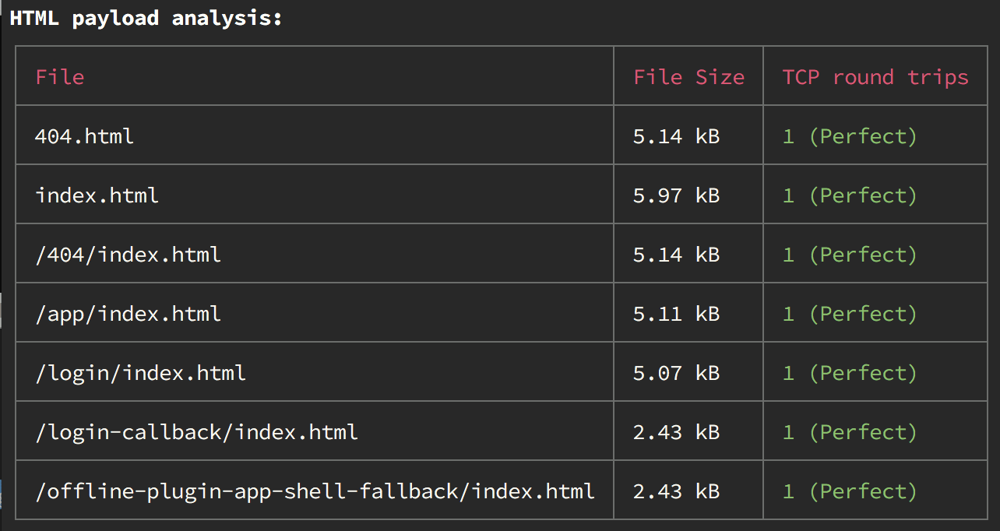

# Gatsby Plugin HTML Payload Size

<p align="center">
  <a href="https://www.npmjs.com/package/gatsby-plugin-html-payload-size">
    
  </a>
  &nbsp;
  <a href="http://npm-stat.com/charts.html?package=gatsby-plugin-html-payload-size">
    
  </a>
</p>

> Show and analyzes your initial HTML payloads. Warns you if your HTML files get to big.

This is heavily inspired by [size-plugin](https://github.com/GoogleChromeLabs/size-plugin) for Webpack.



## ☁️ Installation

```sh
npm i gatsby-plugin-html-payload-size
```

## 🛫 Setup

Add `'gatsby-plugin-html-payload-size'` to the plugins in your `gatsby-config.js` file.

```js
module.exports = {
  plugins: [
    `gatsby-plugin-html-payload-size`
  ]
}
```
